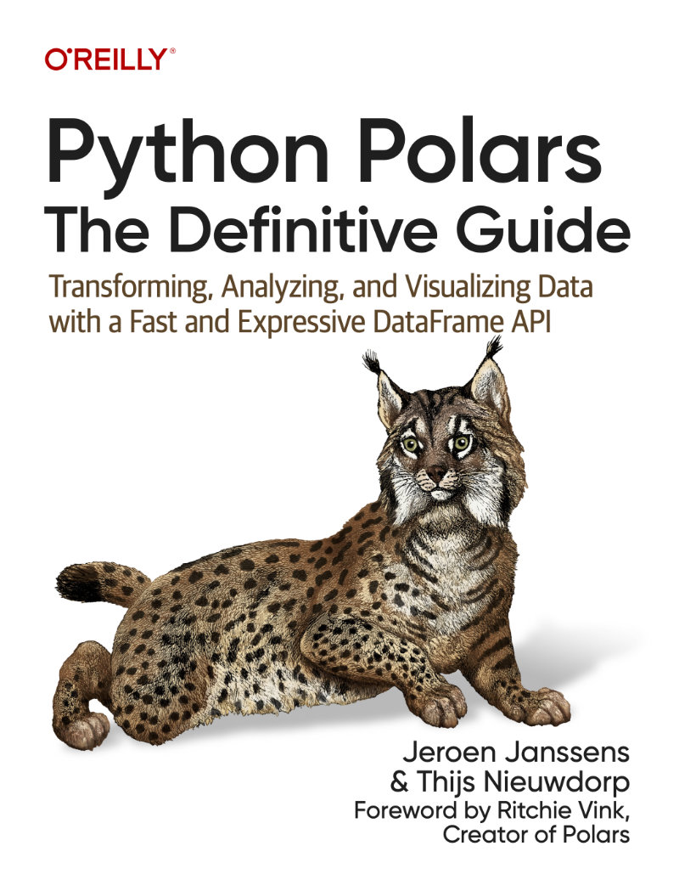

# Python Polars: The Definitive Guide

Welcome to the official repository of the book *Python Polars: The Definitive Guide* by Jeroen Janssens and Thijs Nieuwdorp.
This repository contains all the code and data used in the book.

The book is now available in both print and ebook formats at your favorite bookstore.
Visit [polarsguide.com](https://polarsguide.com) for more information.

 

